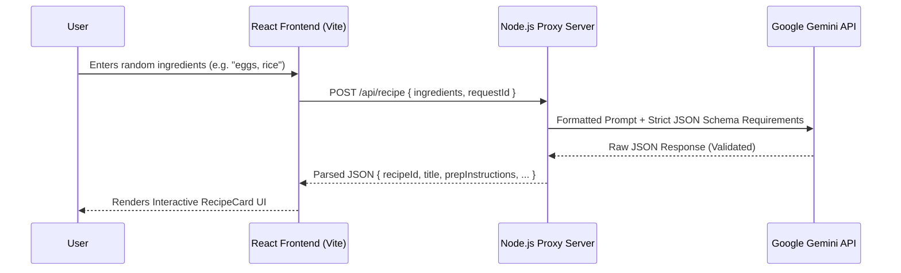
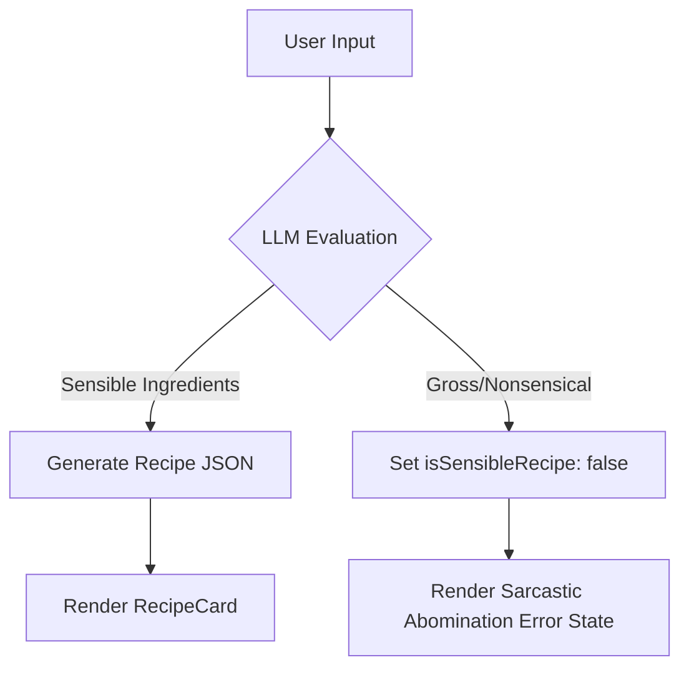

# Fridge-to-Recipe Interactive Web App 🍳

Welcome to the **Fridge-to-Recipe** project! This repository contains an interactive, AI-powered web application designed to help bachelors and busy folks turn whatever is left in their fridge into a structured, step-by-step recipe.

## 🎯 Architecture Overview

This project implements a **Dual-Tier Architecture** to strictly adhere to security best practices. We never expose our LLM API keys to the browser network headers or bundle code. Instead, we use a lightweight Node.js Express proxy to securely handle LLM communication and enforce strict JSON schemas.

### System Flow



---

## 🚀 Getting Started (Local Development)

To get this app running on your local machine, you'll need to run **both** the frontend and backend servers concurrently.

### 1. Environment Setup

First, duplicate the `.env.example` file to create your own `.env` file in the root directory:

```bash
cp .env.example .env
```

Open the `.env` file and add your Google Gemini API key:
```env
GEMINI_API_KEY=your_actual_api_key_here
PORT=3001
```

### 2. Start the Backend Proxy

The backend proxy runs on Node.js and Express. It listens on port `3001` and securely proxies requests to the LLM API.

```bash
npm install # if you haven't already
npm run server
```
*Note: The server runs on `http://localhost:3001`. Keep this terminal window open!*

### 3. Start the React Frontend

Open a **new** terminal window, and start the Vite development server for the React app:

```bash
npm run dev
```
*The frontend will typically run on `http://localhost:5173`. You can now open this URL in your browser.*

---

## 🏗️ Project Structure & Key Concepts

### Frontend (`/src`)
We are using **React** heavily styled with **Tailwind CSS v4**.

*   `App.jsx`: The main entry point. Handles the state for the input form, loading spinners, and the "Culinary Abomination" guardrail.
*   `components/RecipeCard.jsx`: The main container component for a successfully generated recipe.
*   `components/IngredientList.jsx`: Renders ingredients and includes the **Dynamic Servings** logic. Modifying the servings automatically scales ingredient quantities in real-time using a mathematical multiplier.
*   `components/StepList.jsx`: Renders both Preparation and Cooking instructions with progress bars and checkable states.
*   `components/StepTimer.jsx`: An interactive, playable countdown timer component for steps that require specific cooking durations.

### Backend (`/api/index.js`)
The backend is intentionally minimal. Its primary responsibilities are:
1.  **Security**: Holding the `GEMINI_API_KEY` server-side so it isn't bundled into the frontend code.
2.  **Schema Enforcement**: We pass a strict `RECIPE_SCHEMA` to the Gemini API, ensuring the LLM returns structured JSON (not a conversational chat string). This allows our React frontend to map data directly to typed components safely.
3.  **Vercel Serverless Ready**: By placing the backend inside the `/api` folder and exporting the Express app, Vercel automatically treats it as a highly scalable Serverless Function!

---

## 🌐 Deployment (Vercel)

This app is fully optimized for a "Zero-Config" All-in-One deployment on **Vercel**. 

1. Push this repository to GitHub.
2. Import the project into your Vercel Dashboard.
3. In the deployment settings, go to **Environment Variables** and add your `GEMINI_API_KEY`.
4. Click **Deploy**.

Vercel will automatically build the Vite frontend AND transform `/api/index.js` into a serverless function. You don't need a separate backend host!

---

## 🛡️ The "Guardrail" Pattern

LLMs can hallucinate or generate nonsensical responses if given garbage input (e.g., "chocolate, ketchup, chillies, ice cream"). 

To handle this gracefully, we implemented a guardrail in the backend prompt. The LLM is instructed to evaluate the ingredients *before* generating a recipe.

*   If the ingredients form a reasonable meal: `isSensibleRecipe` is set to `true`.
*   If the ingredients are an abomination: `isSensibleRecipe` is set to `false`, and it returns a `sarcasticRejectionMessage` instead.

Our frontend (`App.jsx`) intercepts this `isSensibleRecipe === false` flag and renders a dedicated rejection UI, saving the app from trying to render a broken or gross recipe.



---

## 💡 Junior Dev Quick Tips

When reading through this codebase, pay attention to these specific patterns we used:

1.  **Tailwind v4 Setup**: Notice we use `@import "tailwindcss";` in `src/index.css` rather than the older v3 `@tailwind` directives.
2.  **Handling Race Conditions**: In `App.jsx`, take a look at the `requestIdRef`. When fetching data from an LLM (which can take 5-10 seconds), the user might click "Submit" multiple times. We use a `useRef` to track the *latest* request ID and silently discard any stale API responses that resolve out of order. This prevents the UI from flashing old data.
3.  **State Management**: Notice how the `servings` state in `RecipeCard.jsx` flows down to `IngredientList.jsx` as a calculated `multiplier`, allowing the ingredients component to remain stateless and declarative.
